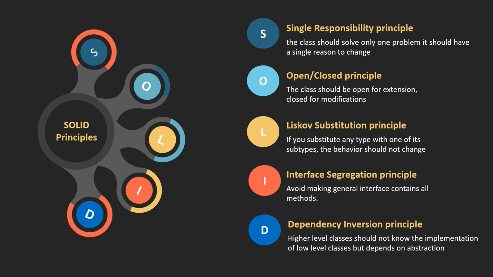
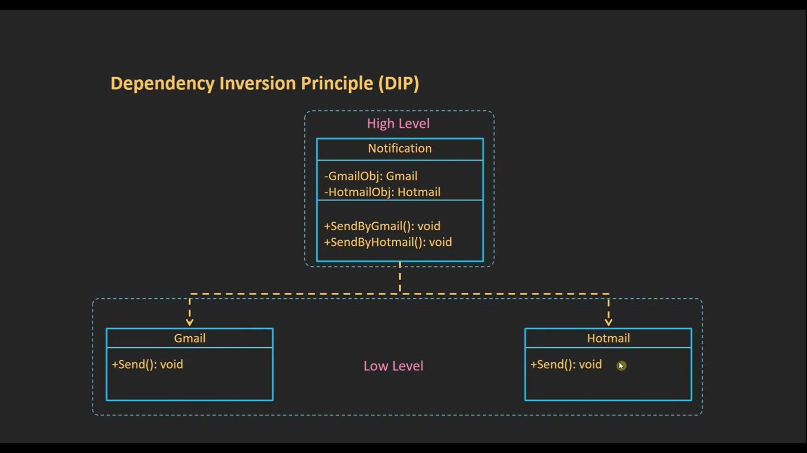
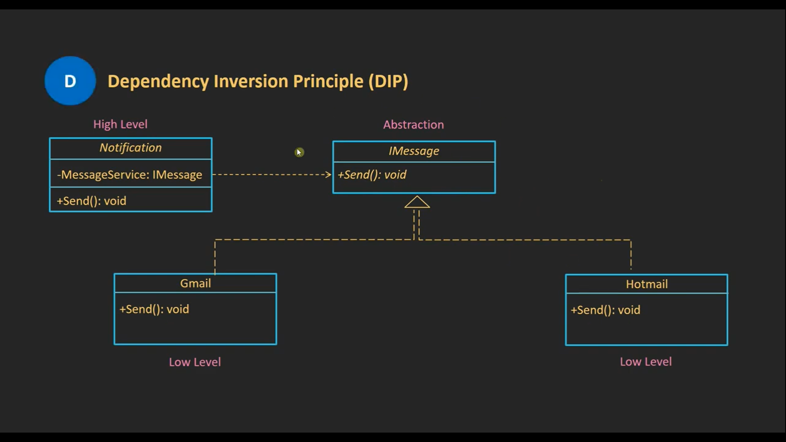

# Table of Content
- [What is SOLID Principle](#what-is-solid-principle)
- [What Problems Does SOLID Come to Solve](#what-problems-does-solid-come-to-solve)
- [What is this Principle](#what-is-this-principle)
  1. [Single Responsibility Principle (SRP)](#single-responsibility-principle-srp)
  2. [Open-Closed Principle (OCP)](#open-closed-principle-ocp)
  3. [Liskov Substitution Principle (LSP)](#liskov-substitution-principle-lsp)
  4. [Interface Segregation Principle (ISP)](#interface-segregation-principle-isp)
  5. [Dependency Inversion Principle (DIP)](#dependency-inversion-principle-dip)
- [Resources](#resources)


# What is SOLID Principle

**SOLID** is five design principles intended to make object-oriented designs more:  
- understandable  
- flexible  
- maintainable  
- testable  
- reusable  

Think of them as **rules of thumb for writing good, clean Object-Oriented code**, much like grammar rules for writing clear sentences.  


# What Problems Does SOLID Come to Solve

1. Classes or functions become **too big** and handle multiple concerns.  
2. Every time **requirements change**, you must **modify old code**.  
3. Wrong inheritance → subclasses do not behave like their parent.  
4. Interfaces become **too large**, forcing classes to implement methods they do not need.  
5. Code is **tightly coupled to concrete implementations**.  


# What is this Principle

### 1. **Single Responsibility Principle (SRP)**  
### 2. **Open/Closed Principle (OCP)**  
### 3. **Liskov Substitution Principle (LSP)**  
### 4. **Interface Segregation Principle (ISP)**  
### 5. **Dependency Inversion Principle (DIP)**  


# Single Responsibility Principle (SRP)

## What is SPR
A **class** or **function** should have only one reason to change

> A **reason to change** = a **different kind of responsibility**.

###  Fore example `userService`
The **UserService’s responsibility is to manage user-related business logic and user lifecycle.**
That means:
- ✅ Create a user (in the database).
- ✅ Read/fetch user information.
- ✅ Update user info (email, password, profile data, status).
- ✅ Delete/deactivate a user.

What is NOT `UserService` responsibility?
- ❌ Sending emails (that’s **EmailService**).
- ❌ Logging activities (that’s **LoggingService**).
- ❌ Payment/subscription handling (that’s **PaymentService**).
- ❌ Validation (that’s **UserValidator** or DTOs).

**Analogy:** A restaurant. A chef cooks the food, a waiter serves the food, and a cashier handles payments. *You wouldn't want the chef also trying to take orders and handle money.*

### What does **"Reason to Change"** mean?
 It means **a change in a business requirement, rule, or concern**.
 
 ## How to Think About "Reason to Change"
- A **reason to change** = a **different kind of responsibility**.
- Common responsibilities are:
    1. **Business logic** (rules, calculations).
    2. **Persistence** (database, files).
    3. **Communication** (email, notifications).
    4. **Presentation** (UI, formatting).
    5. **Configuration** (settings, constants).
If one class mixes two of these → it has multiple reasons to change.

## Example
```ts

class UserManager {

  // Responsibility 1: Business logic
  createUser(user: any) {
    console.log("Validating and creating user:", user);
  }

  // Responsibility 2: Persistence
  saveUserToDatabase(user: any) {
    console.log("Saving user to DB...");
  }

  // Responsibility 3: Communication
  sendWelcomeEmail(user: any) {
    console.log("Sending welcome email to:", user.email);
  }

  // Responsibility 4: Logging
  logAction(action: string) {
    console.log("Log:", action);
  }
  
}

```
### Problems (Many Responsibilities):
1. **Business logic** (user validation).
2. **Database logic** (persistence).
3. **Email logic** (communication).
4. **Logging logic** (cross-cutting concern).

This class has **4 reasons to change**:
- Business rules change (e.g., new validation rules).
- DB schema or DB type changes (MySQL → PostgreSQL).
- Email provider changes (Gmail → SendGrid).
- Logging system changes (console → external logger).

### Apply The SRP
```ts

class UserValidator {
  validate(user: any) {
    console.log("Validating user...");
  }
}

class UserRepository {
  save(user: any) {
    console.log("Saving user to DB...");
  }
}

class EmailService {
  sendWelcomeEmail(user: any) {
    console.log("Sending welcome email to:", user.email);
  }
}

class Logger {
  log(action: string) {
    console.log("Log:", action);
  }
}

// High-level orchestration (only coordinates)
class UserService {
  constructor(
    private validator: UserValidator,
    private repo: UserRepository,
    private email: EmailService,
    private logger: Logger
  ) {}

  register(user: any) {
    this.validator.validate(user);
    this.repo.save(user);
    this.email.sendWelcomeEmail(user);
    this.logger.log("User registered");
  }
}

```
## Why This is Better
- Each class has **1 reason to change only**.
- If DB changes → only `UserRepository`.
- If email changes → only `EmailService`.
- If logging changes → only `Logger`.
- If validation rules change → only `UserValidator`.
- `UserService` just **glues everything together**.

## How can i knew if this method is belong to the User Responsibility

### Checklist for User (apply on any thing like user) Responsibility
1. **Does this method modify or query the user’s own data (like email, password, profile info, status)?**
    - ✅ Yes → belongs to `UserService`.
    - ❌ No → move it somewhere else.

2. **If the user table/schema changes, would this method likely change too?**
    - ✅ Yes → it's user responsibility.
    - ❌ No → it’s another service’s job.

3. **Is this action part of the “user lifecycle” (create, update, deactivate, ban, etc.)?**
    - ✅ Yes → `UserService`.
    - ❌ No → e.g., sending emails, payments → separate service.

4. **Does it require the user entity itself to perform, or is it external?**
    - ✅ Needs user entity (change password, update email) → `UserService`.
    - ❌ External (send email, log activity) → different service.

# Open-Closed Principle (OCP)

>Software **entities** (classes, modules, functions, etc.) should be *open for extension* but *closed for modification*.

## What does that mean?
- **Open for extension** → You should be able to **add new functionality**.
- **Closed for modification** → You should **not need to change existing code** to add that functionality.

don’t keep editing the same class **every time requirements change**. Instead, design it so you can **extend it** (via *inheritance*, *interfaces*, *composition*, or *polymorphism*).

## Example
```ts

class ReportGenerator {

  generate(type: string, data: any) {
    if (type === "pdf") { // for Pdf
      console.log("Generating PDF report...");
    } else if (type === "csv") { // for csv
      console.log("Generating CSV report...");
    } else if (type === "json") { // for json
      console.log("Generating JSON report...");
    }
  }
}

```
Problems:
- Every time you add a new format (`Excel`, `XML`), you must **modify this class**.by do this 
```ts

class ReportGenerator {

  generate(type: string, data: any) {
    if (type === "pdf") { // for Pdf
      console.log("Generating PDF report...");
    } 
    .... // the above code
    else if (type === "Excel") { // for csv
      console.log("Generating Excel report...");
    } else if (type === "XML") { // for json
      console.log("Generating XML report...");
    }
  }
}

```
solution 
 - by follow OCP 
 ```ts
 
interface Report {
  generate(data: any): void;
}

// Extensions
class PdfReport implements Report {
  generate(data: any) {
    console.log("Generating PDF report...");
  }
}

// Extensions
class CsvReport implements Report {
  generate(data: any) {
    console.log("Generating CSV report...");
  }
}

// Extensions
class JsonReport implements Report {
  generate(data: any) {
    console.log("Generating JSON report...");
  }
}

class ReportGenerator {
  constructor(private report: Report) {}
  
  // Context (open/closed principle applied)
  generate(data: any) {
    this.report.generate(data);
  }
}

// Usage
const pdfReport = new ReportGenerator(new PdfReport());
pdfReport.generate({ title: "Sales Report" });

const csvReport = new ReportGenerator(new CsvReport());
csvReport.generate({ title: "Sales Report" });

 ```
###### now when you wanna add new feature like add `XML` you will add new class and the original code don't change

# Liskov Substitution Principle (LSP)

> _Objects of a superclass should be replaceable with objects of its subclasses without breaking the correctness of the program._

Meaning:
If `B` is a subclass of `A`, then you should be able to use `B` **anywhere `A` is expected**, Without the program being bad.

>The whole problem lies in the behavior of methods. When the parent provides a method, the child should fully support it and maintain the same contract (with his rule but support the behavior).

## What does **behavior** mean here?
When we design a parent class (or interface), we are **promising a certain behavior (contract)**.
- Behavior = **how a method is expected to work** + **the guarantees it gives**.
- Subclasses must keep that promise.
If a subclass changes that behavior in a way that breaks the promise, it **violates LSP**.

# Example
```ts
class Bird {
  fly(): string {
    return "I can fly!";
  }
}

```
The **behavior** promised is:
- All `Bird`s can `fly`.
break the contract
```ts
class Penguin extends Bird {
  fly(): string {
    throw new Error("Penguins can't fly!"); // ❌ Breaks the promise
  }
}

```
- `Penguin` changes the **behavior** (instead of flying, it crashes).

### LSP solution
```ts
class Bird {
  makeSound(): void {
    console.log("Some bird sound");
  }
}

interface Flyable { // ✅ solution
  fly(): void;
}

class Sparrow extends Bird implements Flyable {
  fly(): void {
    console.log("Sparrow flying!");
  }
}

class Penguin extends Bird {
  swim(): void {
    console.log("Penguin swimming!");
  }
}

```
- Now the **behavior is consistent**:
    - `Flyable` → always flies.
    - `Bird` → always makes sound.
    - No surprises.

## Why LSP matters
- Prevents **wrong inheritance** (forcing “is-a” relationships where they don’t belong).
- Makes sure **subclasses don’t break parent expectations**.
- Keeps polymorphism safe.

## You can say
**“If a subclass cannot behave exactly like its parent in all cases, it violates LSP.”**

# Interface Segregation Principle (ISP)

> “No client should be forced to depend on methods it does **not use**.”

In other words:
- Interfaces (abstract class ) should be **small and specific**.
- Don’t create “fat” interfaces that make classes implement methods they don’t need.
- Makes the code **flexible, reusable, and clean**.
-  from his name make separation for interface don't make it have all the methods

## Example: Payment System
### Wrong
```ts
interface FileOperations {
  readFile(path: string): string;
  writeFile(path: string, content: string): void;
  compressFile(path: string): void;
  encryptFile(path: string): void;
}

```
**Problem:**
- If I **only want to implement** a simple `ReadOnlyFileReader`, I still have to implement `writeFile`, `compressFile`, and `encryptFile` — even though they don’t make sense.
### ✅ Correct Design (Respecting ISP)
```ts
interface Readable {
  readFile(path: string): string;
}

interface Writable {
  writeFile(path: string, content: string): void;
}

interface Compressible {
  compressFile(path: string): void;
}

interface Encryptable {
  encryptFile(path: string): void;
}

class ReadOnlyFileReader implements Readable {
  readFile(path: string): string {
    return `Reading file from ${path}`;
  }
}

class SecureFileWriter implements Writable, Encryptable {
  writeFile(path: string, content: string): void {
    console.log(`Writing to ${path}`);
  }

  encryptFile(path: string): void {
    console.log(`Encrypting ${path}`);
  }
}

```
✅ **Now:**
- `ReadOnlyFileReader` is not forced to implement useless methods.
- `SecureFileWriter` only implements what it really needs.

# Dependency Inversion Principle (DIP)

> **High-level modules should not depend on low-level modules. Both should depend on abstractions level.**  
> 
> Abstractions should not depend on details. Details should depend on abstractions.

I think
> “From its name, Dependency Inversion means inverting the relationship between two classes: *instead of high-level classes depending on low-level classes*, **both depend on an abstraction**. This hides the details (implementation) behind the abstraction. 
> 
> Following this principle also helps achieve the **Open/Closed Principle (OCP)**, because we can add new implementations without modifying the high-level code.”

- **DIP (Dependency Inversion Principle)** → a **principle/rule** that says:  
    _“Depend on abstractions, not on concrete implementations.”_
- **DI (Dependency Injection)** → a **technique/pattern** that we usually use to **apply DIP in real code**.
So:
- DIP tells you **what you should do** (invert dependency direction).
- DI tells you **how to do it** (inject dependencies via constructor, property, or method).

*solve tight coupling problem*

## Example 1
```ts
// High-level: UserService
class UserService {
  private db: MySQLDatabase; // ❌ depends on concrete implementation

  constructor() {
    this.db = new MySQLDatabase();
  }

  getUsers(): string[] {
    return this.db.query(sql);
  }
}

// Low-level: specific database
class MySQLDatabase {
  query(sql: string): string[] {
    console.log("Querying MySQL:", sql);
  }
}

const userService = new UserService();
console.log(userService.getUsers());

```
**Problem:**
- `UserService` depends **directly on MySQLDatabase**.
- If you switch to PostgreSQL, MongoDB, or an API, you must rewrite `UserService`.
## apply DIP by DI (Dependency Injection)
```ts

interface Database {
  query(sql: string): string[];
}

// Low-level implementation (MySQL)
class MySQLDatabase implements Database {
  query(sql: string): string[] {
    console.log("Querying MySQL:", sql);
  }
}

// Another implementation (PostgreSQL)
class PostgreSQLDatabase implements Database {
  query(sql: string): string[] {
    console.log("Querying PostgreSQL:", sql);
  }
}

// High-level depends on abstraction, not concrete class
class UserService {
  constructor(private db: Database) {} // ✅ injection of abstraction

  getUsers(): string[] {
    return this.db.query();
  }
}

// Usage
const mysqlDb = new MySQLDatabase();
const postgresDb = new PostgreSQLDatabase();

const userService1 = new UserService(mysqlDb);
console.log(userService1.getUsers()); // from MySQL

const userService2 = new UserService(postgresDb);
console.log(userService2.getUsers()); // from PostgreSQL

```
✅ **Now:**
- `UserService` only depends on `Database` (abstraction).
- Any DB implementation can be injected (MySQL, PostgreSQL, MongoDB, mock for testing, etc.).
- Swapping implementations requires **no changes** in high-level code.

## Another Example
Violation DIP


apply DIP


# Resources
- [Mohammed Reda Playlist (Youtube)](https://www.youtube.com/playlist?list=PLnqAlQ9hFYdflFSS4NigVB7aSoYPNwHTL)
- [Wikipedia (SOLID) and other nested documents](https://en.wikipedia.org/wiki/SOLID)
